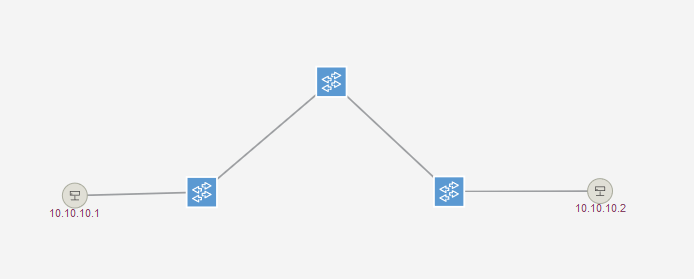
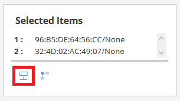

# Reproduction de LFA sur controleur ONOS

_Article MISC n° 109_

_Flavien Joly-Pottuz / Stefano Secci_ | _**CNAM PARIS**_

## Installation du système

Les étapes ci-dessous permettent la mise en place de l'infrastructure décrite dans l'article 
"MISC Attaques par fabrication de liens dans le SDN".

**1 /**  Installation minimale d’Ubuntu 18.4 LTS (machine type :20Gb HDD/8Gb RAM/ 2vCPU)

_**Attention : Pensez à installer le serveur SSH pour effectuer l'ensemble des étapes suivantes depuis un terminal.**_

**2 /** Installation des utilitaires système nécessaires :

`apt-get install openvswitch-switch python3.6 python3-pip`

**3 /** Vérification de la version de python

Une version 3.6 minimum est nécessaire car des f-strings sont utilisés dans les scripts python.

```
python3 --version
Python 3.6.9 
```

**4 /** Installation de SCAPY

Installation de la version 2.4.3 de la librairie SCAPY.

```
pip3 install scapy
```


**5 /**	Installation de java 8 
```
# Pour la suite de l’installation on se place dans /opt
cd /opt

# On télécharge l’archive de la version 8
wget -c --content-disposition https://javadl.oracle.com/webapps/download/AutoDL?BundleId=239835_230deb18db3e4014bb8e3e8324f81b43

# On renomme le fichier téléchargé par un nom plus simple
mv jdk-8u221-linux-x64.tar.gz\?GroupName\=JSC\&FilePath\=%2FESD6%2FJSCDL%2Fjdk%2F8u221-b11%2F230deb18db3e4014bb8e3e8324f81b43%2Fjdk-8u221-linux-x64.tar.gz\&BHost\=javadl.sun.com\&File\=jdk-8u221-linux-x64.tar.gz\&AuthParam\=1576094699_9eebfcd8fa45d1 jdk-8u221-linux-x64.tar.gz

# On décompresse l’archive contenant les fichiers nécessaires à l’installation
tar xzf jdk-8u221-linux-x64.tar.gz

# On installe ensuite la totalité des composants a l'aide du script suivant
for JavaCommand in java jar java2groovy javac javadoc javafxpackager javah javap javapackager javaws
do
         sudo update-alternatives --install /usr/bin/$JavaCommand $JavaCommand /opt/jdk1.8.0_221/bin/$JavaCommand 1
done
```

**6 /**	Installation d’ONOS en mode service suivant la [documentation officielle](https://wiki.onosproject.org/display/ONOS/Running+ONOS+as+a+service )

```
# Téléchargement des versions d’ONOS nécessaires (1.14.0 & 1.15.0)
wget https://repo1.maven.org/maven2/org/onosproject/onos-releases/1.15.0/onos-1.15.0.tar.gz
wget https://repo1.maven.org/maven2/org/onosproject/onos-releases/1.14.0/onos-1.14.0.tar.gz

# Décompression des archives téléchargée 
tar xzf onos-1.14.0.tar.gz
tar xzf onos-1.15.0.tar.gz

# Création du lien symbolique vers la version 1.14.0 pour poursuivre l’installation
ln -s /opt/onos-1.14.0 /opt/onos
# On déploie alors ONOS afin qu’il tourne en tant que service
cp /opt/onos/init/onos.initd /etc/init.d/onos
update-rc.d onos defaults
cp /opt/onos/init/onos.service /etc/systemd/system/
systemctl daemon-reload
systemctl enable onos

# ONOS installé et démarré, il faut installer les packages nécessaires aux reproductions (fwd & OpenFlow)
service onos start
ssh -p 8101 karaf@localhost (mot de passe: karaf)
    app activate org.onosproject.fwd
    app activate org.onosproject.openflow
    logout
service onos stop

# On fait de même pour la version 1.15.0
rm onos
ln -s /opt/onos-1.15.0 /opt/onos
service onos start
ssh-keygen -f "/root/.ssh/known_hosts" -R "[localhost]:8101" # Suppression de la clé SSH de la version 1.14.0
ssh -p 8101 karaf@localhost (mot de passe: karaf)
    app activate org.onosproject.fwd
    app activate org.onosproject.openflow
logout

# On revient à la version 1.14.0, utilisée pour la premiere reproduction
service onos stop
rm onos
ln -s /opt/onos-1.14.0 /opt/onos
service onos start
ssh-keygen -f "/root/.ssh/known_hosts" -R "[localhost]:8101" # Suppression de la clé SSH de la version 1.15.0
```

### Accéder au dashboard ONOS

Le dashboard est alors accessible depuis l'interface web situé a l'adresse suivante :

```
http://<IP-machine-hote>:8181/onos/ui/ 
```

Les identifiants sont 'onos/rocks'

## Récupération du code nécéssaire aux reproductions ##

Nous allons ensuite cloner le contenu de ce dépot via Git afin de récuperer les scripts.
```
git clone https://github.com/FlavienJP/LFA-Attack-ONOS.git
```

L'ensemble des scripts se trouvera alors dans `/opt/LFA-Attack-ONOS/scripts`, pensez à le prendre en compte lors de 
l'invocation des différents scripts.

## Mise en place de la topologie

Le script `utilis.py` est utilisé pour créer la topologie réseau via l'appel suivant : `python3 utilis.py --create`

```
root@misc:/opt/LFA-Attack-ONOS/scripts# python3 utilis.py --create
PING 10.10.10.2 (10.10.10.2) 56(84) bytes of data.
64 bytes from 10.10.10.2: icmp_seq=1 ttl=64 time=35.3 ms

--- 10.10.10.2 ping statistics ---
1 packets transmitted, 1 received, 0% packet loss, time 0ms
rtt min/avg/max/mdev = 35.370/35.370/35.370/0.000 ms
Switch s1 : fe:50:a8:72:f4:40
Switch s2 : 0e:d9:9e:5f:16:4e
Switch s3 : ce:64:1e:7a:aa:40
```

**_Attention : A cette étape, le résultat du test de ping doit être concluant, si ce n'est pas le cas il faut vérifier les points 
précédents. Regardez en particulier si les packages d'ONOS fwd et openflow sont bien activés._**

La topologie est alors visible depuis le dashboard.



Si les deux hosts ne s'affichent pas il vous faut cliquer sur l'icone entouré en rouge ci dessous. Le menu se trouve en 
bas à gauche de l'écran.


Enfin, il est possible de voir le chemin enprunté par le flux entre les deux hotes, pour cela il suffit de selectionner 
les deux icones en maintenant la touche maj enfoncée. Puis le menu suivant apparait, en cliquant sur l'icone entouré en 
rouge le flux est alors modélisé sur le graphique. 



Vous pouvez alors passer à la phase de reproduction [Reproduction de l'attaque](reproduction.md), les étapes suivantes
correspondent aux actions réalisés par le script utilis.py utilisé précédemment.

## Mise en place manuelle de la topologie

Les commandes suivantes permettent de mettre en place la topologie de reproduction.

### Ajout des switchs

```
ovs-vsctl add-br {s1|s2|s3}
ovs-vsctl set-controller {s1|s2|s3} tcp:127.0.0.1:6633
```

### Ajout des 4 network namespaces / 2 Hotes + 2 Pirates

```
ip netns add h1
ip netns add h2
ip netns add p1
ip netns add p2
```

### Ajout des connectivités des 4 namespaces précédemment créés

```
ip link add h1-eth1 type veth peer name s1-eth1
ip link add p1-eth1 type veth peer name s1-eth2
ip link add h2-eth1 type veth peer name s3-eth1
ip link add p2-eth1 type veth peer name s3-eth2
```

### Déplacement des veth au sein des namespaces 
```
ip link set h1-eth1 netns h1
ip link set h2-eth1 netns h2
ip link set p1-eth1 netns p1
ip link set p2-eth1 netns p2
```

### Ajout des connectivités entre les switchs (liens S1-S2/S2-S3)
```
ip link add s1-s2 type veth peer name s2-s1
ip link add s2-s3 type veth peer name s3-s2
```

### Attachement des extrémités des liens aux différents  ports sur les switchs OVS

```
ovs-vsctl add-port s1 s1-eth1
ovs-vsctl add-port s1 s1-eth2
ovs-vsctl add-port s1 s1-s2

ovs-vsctl add-port s2 s2-s1
ovs-vsctl add-port s2 s2-s3

ovs-vsctl add-port s3 s3-s2
ovs-vsctl add-port s3 s3-eth1
ovs-vsctl add-port s3 s3-eth2
```

### Configuration des parametres réseaux Hôtes et Pirates
```
ip netns exec h1 ifconfig h1-eth1 10.10.10.1/24
ip netns exec h1 ifconfig lo up
ip netns exec h2 ifconfig h2-eth1 10.10.10.2/24
ip netns exec h2 ifconfig lo up
ip netns exec p1 ifconfig p1-eth1 up
ip netns exec p2 ifconfig p2-eth1 up
```

### Changement d’état des interfaces des switchs
```
ifconfig s1-eth1 up
ifconfig s1-eth2 up
ifconfig s3-eth1 up
ifconfig s3-eth2 up
ifconfig s1-s2 up
ifconfig s2-s3 up
ifconfig s2-s1 up
ifconfig s3-s2 up
```

#### Vérification de la connectivité entre H1 et H2
```
ip netns exec h1 ping 10.10.10.2
```
**_Attention : A cette étape, le résultat du test de ping doit être concluant, si ce n'est pas le cas il faut vérifier les points 
précédents. Regardez en particulier si les packages d'ONOS fwd et openflow sont bien activés._**

